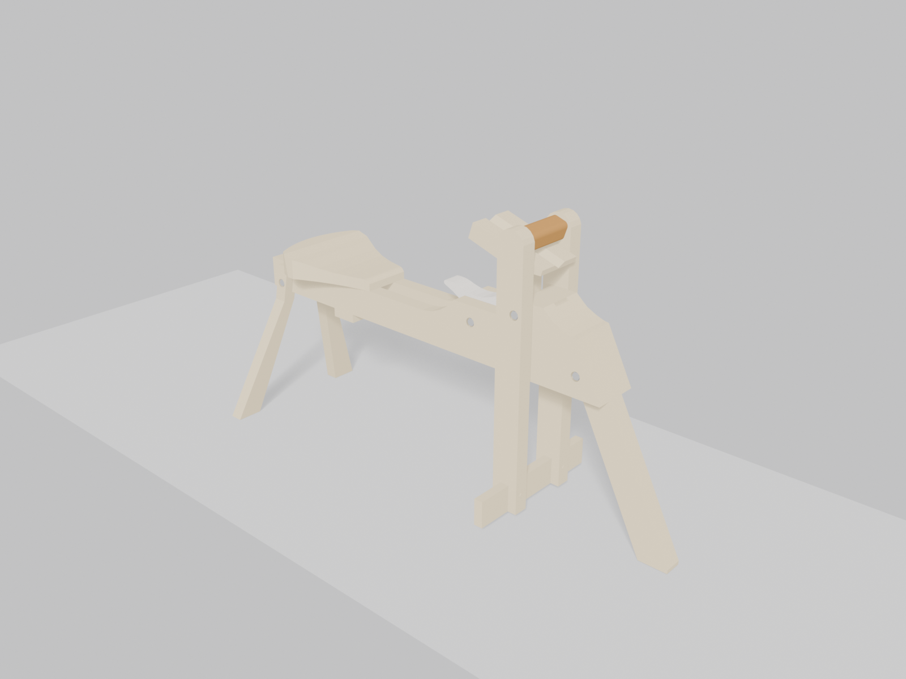

# WoodModels

A 3D cut-list viewer for woodworking plans - and a designer for your own - starting with the Lie-Nielsen/Brian Boggs shaving horse.

`parse_dae.py` reads a COLLADA (`.dae`) export from SketchUp and pulls out every named part's real dimensions and orientation. It fits an oriented bounding box per part, not just an axis-aligned one, which matters for parts drawn pre-rotated in their own geometry, like splayed legs. The browser viewer then shows the model next to an interactive cut list, with shop tools on top: rough-stock sizing, board feet, cutting diagrams, measuring and compound angles.



## What's here

- `viewer/` - the browser app (three.js, no build step)
  - `index.html`, `style.css`, `app.js` - page, styles, 3D scene and selection
  - `cutlist.js` - sidebar cut list, totals, CSV export, printable cut sheet
  - `diagram.js`, `nesting.js`, `inventory.js` - shopping list, cost estimate, cutting diagrams, boards you already have
  - `template.js` - printable full-size part templates
  - `geometry.js` - oriented-box contact tests (what joins what, where holes go), tenons and mortises, overlapping pieces and joining them
  - `features.js` - the cuts drawn in a part (holes, notches, mortises, dados, grooves, rabbets), found by casting a grid of rays through it
  - `design.js` - the design format and the compiler that turns a design into the viewer's own six data files
  - `archetypes.js` - parametric starting points (table, workbench, stool, bench, bookcase)
  - `designer.js` - the designer panel: parts, joints, drafts and review
  - `designcontrols.js`, `modeling.js` - 3D selection, transform handles, snapping, linked copies and undo/redo
  - `review.js` - the design rules (wood movement, joint proportions, spans, stock sizes, ergonomics), pure and unit-tested
  - `woodprops.js`, `movement.js`, `spans.js`, `joinery.js`, `stock.js`, `ergonomics.js` - the data and maths behind them: species properties, seasonal movement, sag, joint sizing, what the yard sells, standard furniture sizes
  - `designreview.js` - the Design review panel: builds a review from the model on screen and draws the findings
  - `autofix.js` - tells a board modeled as two overlapping pieces, or a stray copy, from a lap joint (automatic fixes on load)
  - `measure.js` - distance / angle / bevel tools with snapping
  - `angles.js`, `format.js` - compound-angle math, fractions, rough stock, board feet (pure, unit-tested)
  - `library.js`, `collada.js`, `zip.js`, `modelstore.js` - uploading models in the browser: COLLADA parser (a port of `parse_dae.py`), zip/KMZ reading, saved models (IndexedDB)
  - `edits.js` - your renames, deleted parts and parts set aside, per model
  - `look.js` - the stage each model stands on (ground grid, shadows, lights fitted to its size), smooth shading, non-wood materials
  - `woodtex.js` - species wood textures (side and end grain) generated in the browser
  - `build.js` - build mode's step order (assembly or cutting)
  - `mechanisms.js`, `mechpanel.js` - moving parts: lids on hinges, trays that slide and lift out (the maths, pure and unit-tested; and the panel and Hands on)
  - `share.js` - Share: QR code of the page, sending a model file or the shopping list (QR encoder vendored in `vendor/qrcode/`, MIT)
  - `settings.js` - per-browser preferences (units, allowances, parts ticked off)
  - `model.json` - per-model settings: title, friendly part names, notes, materials, axis names, view presets, moving parts
  - `models/heirloom-chest/` - a second model: an heirloom tool chest whose lid opens and trays come out (`?model=models/heirloom-chest/`)
  - `vendor/three/` - pinned three.js 0.160 build and the three addons used (MIT)
  - `scene.obj`/`.mtl`, `parts_report.json`, `object_dims.json`, `materials.json` - data generated by `parse_dae.py`
- `parse_dae.py` - SketchUp COLLADA → viewer data (Python standard library only)
- `scripts/update_prices.py` - refreshes `viewer/prices.json` from the lumber price indexes (run weekly by `.github/workflows/prices.yml`)
- `tests/` - parser tests, viewer unit tests and a headless browser smoke test
- `renders/` - static preview renders (Blender)
- `shavehorse.blend` - Blender scene with the model imported

## Running the viewer

It has to be served over HTTP, not opened as a `file://`, because it fetches its JSON:

```
cd viewer
python3 -m http.server 8743
```

Then open http://localhost:8743. Everything it needs is in the `viewer/` folder (three.js is vendored under `viewer/vendor/three/`), so it works offline: copy the folder to a shop laptop or tablet and serve it there.

### On a phone or tablet in the shop

The viewer is an installable web app that keeps working offline once it has been opened. To get a URL for your phone:

1. In the repo settings, enable **Pages** with **GitHub Actions** as the source.
2. Run the **publish viewer** workflow from the Actions tab.

It only publishes when you run it by hand. Open the published page once while online, then use "Add to Home Screen". After that it opens without a connection, model included.

**Share** (in the cut list) gets a project onto your phone: on the published page it shows a QR code to scan with the phone's camera. An uploaded model lives in one browser, so Share sends its file instead - through the share sheet (AirDrop, Messages, email) where there is one, else as a download - and you add it on the phone under Models. Share also has the shopping list as text, to send to yourself or the lumber yard.

On a phone the layout follows how you hold it (model above the list upright, side by side sideways), measuring snaps from further away for a fingertip, and the ? help lists the touch gestures. The 3D view only redraws when something changes, so an idle page doesn't drain the battery.

## Using it

**Cut list** (right sidebar)
- Parts are grouped Wood / Hardware / Leather, then by assembly. Sizes are finished **T × W × L**.
- **Units**: fractional inches (1/16, 1/32, 1/8), decimal inches or mm.
- **Rough stock**: shows the lumber to mill each part from: the next standard thickness (4/4, 5/4, 8/4, 10/4…) plus length and width allowances you can set. Board feet are shown per part, and totals per species and thickness.
- **Tick parts off** as you cut them; the progress bar and your ticks are remembered in the browser.
- **Filter** (`/`), **hide a category** in 3D (e.g. hardware), **Export CSV**, **Print cut sheet** (or Ctrl+P). The printed sheet has checkboxes, rough sizes, your notes, an overview picture, a drilling list, the joinery, the cuts in each part, the shopping list and the cutting diagrams.
- **Shopping list & cutting diagram** (`C`):
  - Lays the rough parts out on boards of your stock size (length, width, kerf), grouped by species and thickness. Shows how many boards to buy and how much of each is used, and flags when an offcut will do.
  - Cuts follow a real sequence: crosscut into sections, rip into strips, crosscut the parts. Click a piece to find it in 3D.
  - A part much wider than your boards (a table top) is laid out as the strips you'd glue it up from, each 1/4" wide for jointing; one just over your board width says to buy a wider board.
  - **Sheet goods** (plywood, MDF, OSB, Masonite/hardboard, particle board, melamine...) are laid out on full sheets instead - 4×8 by default, or 5×10, 5×5, 4×4 or 2×4 - per material and thickness, at finished size. Materials whose name says what they are are detected automatically; otherwise pick **Sheet goods** in **Set up**.
  - Hardware is totalled per size, e.g. rod pieces and the stock length to buy. Anything that is neither wood nor hardware is folded away under *Other parts*.
  - Enter a price per board foot for a lumber cost estimate. Species you leave blank use a **typical price** (≈), from `prices.json`: typical US retail $/bf per species, raised for thick stock, and moved with the public US producer price indexes for hardwood and softwood lumber. The **update lumber prices** workflow refreshes it every Monday (or run it from the Actions tab) and republishes the viewer when prices change. Yards vary a lot - put in what yours charges.
  - **My boards**: list the boards you already have (species, thickness, width, length, how many). Parts are laid out on your boards first, marked *Your board* in the diagram, and the shopping list only counts what's left to buy. The list is kept in this browser for every project.
- **Your notes**: add a note to any part from its card; it shows in the list, CSV and printout.
- ⚠ notes flag known problems in the source model (e.g. rods whose name says 8-1/4" but are modeled 6-7/8").

**Build mode** (▶ Build at the top of the cut list) - the plan as a step-by-step guide for the shop, made for a phone:
- One part per step, big: letter, name, quantity, finished and rough size, what it joins, its tenons or mortises, its holes, the other cuts in it and your notes. Tick **Cut** and it moves on to the next part.
- The model assembles as you go: parts from earlier steps solid, this one highlighted with its dimensions, the rest ghosted. Tap any part to jump to its step.
- **Assembly order** builds from the ground up, assembly by assembly; **Cutting order** groups the wood by species and stock thickness, widest and longest first, the way you'd mill it.
- It remembers where you were. ← / → (or Back / Next) step through; Esc leaves.
- In assembly order, once a sub-assembly's parts are all cut there's an **Assemble** step: its parts and hardware, highlighted together, and a dry-fit / check square / glue-and-clamp checklist.
- **Build log**: 📷 Photo on any step takes a picture (or picks one) and keeps it with the model in this browser; tap a thumbnail to see it full size or delete it.
- **Hands-free**: 🎤 (where the browser supports speech) listens for "next", "back" and "done" - handy with glue on your hands. On a phone you can also swipe the step panel sideways.
- The phone's screen stays on while you're in build mode (where the browser allows it), and the steps follow any edits you make along the way.
- Sideways on a phone, the step sits down the side with the model beside it.

**3D view**
- **Realistic wood**: each species has its own look - colour, growth rings with cathedral grain along the board, open pores in oak and ash, oak's ray fleck, knots in pine - with end grain on the ends of boards. The species is guessed from the material's name (in several languages); pick it yourself under **Looks like** in Set up. Wood that isn't a known species keeps the model's own colour, light or dark, with either **tight grain** (hardwood: fine rings) or **wide grain** (softwood: bold bands) - also under Looks like. When a model comes with its own photos of the wood (3D Warehouse models usually do), those are shown instead - laid along each board's length, with matching end grain - and kept with the upload (and in its Download/Share zip); pick a species or grain style under Looks like to use the generated look instead. Photos on other materials (fabric, stone, a textured finish) are shown too, and a photo that's plainly wood - streaky and wood-coloured - under a name that doesn't say so (Warehouse models are full of "Material12") is counted as wood when you upload it; change it in Set up if it isn't.
- **Any model looks right on arrival**: it stands on a ground grid sized to it (quarter inches under a small box, inches and feet under furniture, 4' squares under a shed) with a soft shadow beneath it, wherever it was drawn in SketchUp, and the lights, shadows and camera range follow its size. Every part is outlined like a SketchUp drawing (its corners, chamfers and shoulders, not the seams of a round part), so boards that meet read as separate pieces. Round parts (dowels, turned legs, rods) are shaded smooth while square edges stay crisp, faces another exporter wrote inside-out (Blender, Fusion, Rhino) are turned the right way instead of leaving holes, and parts that aren't wood look like what their material is called: steel and brass shine, glass is see-through, paint, leather, rubber and fabric each have their own finish.
- A part painted with more than one material (SketchUp leaves unpainted faces as an unnamed "material") is shown and listed as the material covering most of it. Textures are generated in the browser, so they work offline.
- Click a part (on the model or in the list) to isolate it. You'll see its dimensions drawn on the part's own axes and a card with size, quantity and angles.
- Angled parts can show their lean: click **∠ Show angles** on the part's card (it's off until you ask, so only your own measurements are drawn). You get the total lean from plumb (or level) as arcs, split into front-to-back and side-to-side components. Legs also get the chairmaker's resultant/sightline angle and a bevel-gauge setting.
- The card lists what the part **joins** (click to jump there) and its **holes**, e.g. "4 × ⌀1/2" for Threaded Rod". A rod's card is a drilling list of the parts it passes through.
- **Joinery**: where a model draws a part's tenons pushed into the part they join, the card says so - "tenon 3/8" × 2-1/2", 1-1/4" long into Leg, each end" - and gives the **shoulder-to-shoulder** length (the listed length includes the tenons, so it's the one to cut). The part it goes into lists the **mortises** to cut in it; full-width ends list housings (dadoes), and through tenons say so. Where a rail only meets a leg's face (no tenon drawn), the card reminds you to add the tenon's length if you'll mortise it. The printed sheet has the whole joinery list.
- **Cuts**: the card and build mode list what else the model cuts into a part - dog holes, notches for a vise, slots, grooves, rabbets, dados - with sizes, depth (or through) and where along the length, measured from the end marked **0** on the model. Pieces of a part that differ are listed by version. Mortises for a tenon and holes for a bolt are listed with those instead, and a tenon's shoulders aren't counted as notches.
- **Print full-size template** (on a wood part's card): face and edge views at 1:1, tiled across letter pages with a 1" check square. Tape the tiles together and trace the part onto your stock.
- **3D / Front / Side / Top** views (`1`-`4`). Straight-on views switch to **Ortho** for true-scale elevations (`O` toggles it).
- **Lay out the exploded view** (on a computer): with the model exploded, select a part and click **✥ Move** on its card, then drag the arrows. Whatever moves with it comes along (its other pieces, the bolts through it). It's saved with the model - scaled by the slider, undoable, **Reset position** puts it back - so the layout you make on the PC is what the phone shows (and what the printed exploded drawing uses).
- **Merge…** (on a part's card): pick the pieces in 3D that are one solid piece - a slab glued up from boards, a block drawn in halves - and merge them into one part, measured as one. Boards butted end grain to end grain with no joint are joined automatically. **Split apart** undoes either.
- **Explode** slider (`E`), **Section** cut along any axis (cut faces are drawn solid and hatched, like a drawing), **Isolate** (`I`), **Wireframe** (`W`), **Screenshot**, **Light/Dark** theme (`L`).
- Works on tablets and phones: tap to select, pinch to zoom, drag to orbit.
- `↑`/`↓` step through parts, `F` or double-click frames the selection, `Esc` clears. The URL tracks the selected part (`#part=Leg_Rear`), so you can link straight to it.

**Measuring**: select a part first to measure just that part, or measure anywhere with nothing selected.
- **Distance** (`D`): two points. Shows length, slope from level and the X/Y/Z components.
- **Angle** (`A`): pivot then two points.
- **Bevel** (`B`): click two faces to get the angle between them, which is the sliding-bevel setting.
- Clicks snap to endpoints, edge midpoints and edges (like SketchUp), otherwise to the face. With a part selected, the corners and edge midpoints of its outline box snap too, even though they're not on the part. That's handy for measuring an angled cut against the square corner it was cut from.
- Moving along the part's length, width or thickness (or level/plumb) locks the point onto that line and shows a dashed guide, SketchUp-style. While locked, it also snaps to wherever that line meets an edge of the part, its surface or the outline box, so the next point lands exactly on, say, an angled cut. A marker previews the snap. `Backspace`/`Ctrl+Z` undoes.
- Dragging to orbit or pan never changes the selection. Only a plain click does.

Press `M` to open the models list (upload / switch models). Press `?` in the viewer for all shortcuts; the same panel has a button to reset your saved preferences.

## Designing your own

**Models → Choose a starting design** starts a new project; **Blank project** starts with individual parts, and **Upload a model** imports an existing plan. **✎ Design** edits the currently open design, or offers starting points for an imported model. What you draw compiles into exactly the same six data files an uploaded model has, so the moment you save it you get the cut list, rough stock, board feet, the shopping list and cutting diagrams, full-size templates, build mode, sharing and the printed sheet - none of which know or care that the model was designed rather than downloaded.

**Start from something that is already right.** A blank canvas teaches nothing, so the designer opens on five pieces built to standard practice - a dining table, a workbench, a staked stool, a staked bench and a bookcase - each with the numbers that make it what it is exposed as controls. Change the top width and the aprons follow; change the height and the legs do. Every one of them starts with nothing for the review to complain about, so the first warning you see is one you caused.

**Build directly in 3D.** Click a piece to select it and drag the move, rotate or resize handles. Shift-click selects multiple pieces to move or rotate together. `G` selects Move, `R` Rotate, `S` Resize, and `X`/`Y`/`Z` isolate an axis; press that axis again to unlock it. `F` frames the selection. Dragging empty space still orbits the view.

**Face resizing.** Resize shows six face handles. Drag either face to change that end while keeping the opposite one fixed; **From centre** is available when you want symmetry. The moving face snaps to nearby board edges, and exact dimensions use the same one-ended rule. Press Esc to cancel a resize.

**Snap placement.** Move defaults to a 1/8-inch grid, rotation to 15°. Under **Snapping & exact transforms**, change either increment or choose Free, choose world or part axes, and enable magnetic snapping to other pieces (world movement axes). **Snap place** (`P`) lets you click a source corner, edge midpoint or face centre, then a target point or a point along a visible edge on another piece; the selection moves exactly between those points. After choosing a source, clicking empty ground places it on the ground grid. A green marker previews the point.

**Wood appearance.** Designed boards use continuous procedural growth rings through the solid, so grain runs along the board and wraps onto its ends and edges. Choose among 15 species, plain/quarter/rift sawn grain, and fresh grain patterns per selected piece. Each copy samples a different section; appearance stays attached during transforms and survives saving. The designer shares these materials with the saved build viewer.

**Quick turns.** Select an X, Y or Z axis beside **Turn**, then use **−90°** or **+90°**. These are world-axis turns about the selection centre, with undo.

**Exact sizes, linked copies and history.** The same tool panel accepts an exact move distance, rotation angle or finished dimension. Resize handles follow the piece's length, width and thickness. Copies share dimensions; moving or rotating a copy changes only its placement. **Make independent** separates a selected copy before you change its size. **Duplicate** (`Ctrl+D`), **Delete**, **Undo** (`Ctrl+Z`) and **Redo** (`Ctrl+Shift+Z`) work on the design. Esc cancels a drag or snap operation. **Group parts** names an assembly, including the selected parts' linked copies; **Select assembly** selects its pieces together. The inspector remains available for exact names, materials, sizes, positions and joints. These tools edit designed projects; imported arbitrary meshes continue through the existing viewer workflow.

**Automatic, editable joinery.** New projects infer mortise-and-tenon joints at rail-to-post contacts, dados at shelf-to-side contacts, and half-laps where coplanar rails cross. Preset joints take precedence. **Connections** lets you change the suggestion to a mortise and tenon, through tenon, round tenon, dado, sliding dovetail or no joint; your choice persists when the project is saved. **Automatic** restores the suggestion, and the automatic-joinery checkbox switches inference off. Arbitrary angled or ambiguous contacts can still use the manual joint controls.

**Real cuts in both pieces.** Mortises and dados are subtracted from the receiving solid, round tenons have circular cross-sections, half-laps remove complementary halves, and sliding dovetails generate a matching open groove. Changing a seated dado to a tenon adapts the shoulder without moving the boards. **Inspect joints** temporarily spreads the assembly to expose its cuts; it never changes saved placements. These same solids feed the saved viewer and cut list, including different cut lengths for linked pieces with different end joints. Designed boards stay separate even when their ends touch. Screws, buttons, glue and dowels remain construction notes; the dovetail option is a sliding dovetail, not a box-joint pin-and-tail layout.

**Customize, Model and Review** keep preset options, direct modeling and final findings together. Choosing a starting design opens Customize first, including shelf counts, overall dimensions, stock sizes and project wood. Blank projects open in Model; **+ Board** adds and selects another piece. Dimension fields use inches and apply when you leave the field; changing overall dimensions asks before replacing custom parts or joints. **The review follows your changes**, in the Review step - the same rules described above, but reading the design rather than measuring the model, so it knows which joints you meant to slide (a top on buttons is not a cross-grain trap) and which parts are tenoned into which. Take a bookcase past about 32" wide and it tells you the shelves will show a bow before you cut them; take a bench seat down to 1" and it works out what happens when someone sits in the middle.

**Open build plan** saves and opens the cut list. Editing an existing design updates that project in place; starting from Models always creates a separate project, even when another design is open. Unfinished edits are saved as a browser-local draft and can be resumed when you reopen the designer. Either way the design is stored inside `model.json`, so **✎ Design** on a designed model opens it again, and Download carries it to another computer.

## Moving parts: the heirloom tool chest

Open `?model=models/heirloom-chest/` for a tool chest you can work like the real one: a frame-and-panel lid on two hinges, a chisel tray and a plane tray that slide on runners along the chest's ends, a lift-out saw till at the back, and bail handles that swing up to carry it.

- **Open it up** (top right of the 3D view) has a button and a slider for each: **Open/Close** the lid (or set it to any angle up to 100°), **Lift out/Put back** each tray, slide a tray along its runners, **Raise/Lower** the handles. **Unpack it all** opens the lid and takes every tray out, top one first; **Pack it away** puts them back, bottom one first, and shuts the lid.
- **✋ Hands on** (`H`) works it with the mouse instead: click the lid to open or shut it, drag it to swing it to any angle, drag a tray to slide it, click a tray to lift it out - it's set down on the floor in front of the chest - and click it there to put it back. Clicks don't select parts while it's on; `Esc` or `H` turns it off.
- It goes the way the real chest does. Trays slide only as far as the walls and the other trays let them (the chisel tray runs 3-3/4" forward to the front wall and stops 3/8" short of the saw till). The plane tray sits under the chisel tray, so it can't come out until the chisel tray has; and once the chisel tray is back in, the plane tray can't go back under it. Lifting a tray with the lid shut opens the lid first.
- The lid shuts exactly as the chest was drawn: about its back top edge, the frame landing on the walls at 13", the lid molding on the top molding, flush front and back (`tests/mechanisms.test.mjs` checks this against the model's own measurements).
- The cut list, joinery and templates measure the parts as the model drew them, so opening the lid changes none of it. A selected part's dimensions are drawn where it is now - on the open lid, or on a tray on the floor - and exploding still works on top.

Any model can have moving parts: list them in its `model.json` under `mechanisms`. A **hinge** turns its parts about a line (`pivot`, a point on the hinge line, and `axis`, its direction, with a positive angle opening by the right-hand rule); `drawnAt` is the angle the model drew it at, `partsDrawnAt` any parts drawn at another angle, `range`, `open` and `start` in degrees. A **tray** lifts out and is set down in front of the model; with `slide` (`axis`, and `within` - the inside faces it runs between) it also slides, and `needs` names a hinge that must be open so far before it comes out. `parts` are mesh names from `object_dims.json`, with a trailing `*` for every name that starts so.

```json
"mechanisms": [
  { "id": "lid", "label": "Lid", "kind": "hinge", "parts": ["group_1_*"],
    "pivot": [0, 12.875, -16.5], "axis": [-1, 0, 0], "drawnAt": 20.2, "range": [0, 100], "open": 95 },
  { "id": "chisel-tray", "label": "Chisel tray", "kind": "tray", "parts": ["group_3_*"],
    "slide": { "axis": [0, 0, 1], "within": [-15, -1.5] }, "needs": { "lid": 80 } }
]
```

## Uploading models (3D Warehouse)

Click **Models** at the top of the sidebar (or press `M`), then choose a file - or just drag a file onto the page.

1. On 3D Warehouse, open the model and use **Download → Collada File** (a `.zip`) or **KMZ**. The SketchUp `.skp` download can't be read in a browser; in SketchUp itself, **File → Export → 3D Model → COLLADA (.dae)** works too.
2. Upload the `.zip`, `.kmz` or `.dae`. It's measured in the browser the same way `parse_dae.py` does it (any units, Z-up or Y-up, other exporters' COLLADA 1.4/1.5), so every tool - cut list, rough stock, joins, templates, cutting diagram, angle tools - works on it.
3. A **Set up** dialog opens: name it, pick which materials count as **Wood** (only wood goes into rough stock, board feet and the cutting diagram) or **Sheet goods**, what each wood **looks like** (the species used for its grain in 3D), what each material is **called** (textures of a species it recognises are named after it for you - "Mélèse_Horizontal1" and "Mélèse_Verticale1" both become "Larch" - and any you give the same name total up as one), and which way the front of the piece faces. You can reopen it any time from the **Set up** button in the sidebar.

Uploads are saved in this browser (nothing is sent anywhere), and the page reopens the model you had open last. Ticked-off parts, notes and preferences are kept per model. In the Models list - each with a small picture of it, made once you've had it open a moment - you can switch between models, **Download** one as a zip of the six data files (to back it up, move it to another device - just upload the zip there - or add it to the repo as a `?model=` folder), or **Delete** it.

### Cleaning up a rough model

**Model check** (under the totals in the cut list) looks over a new model for you: wood that touches no other part (a leftover, or drawn in the wrong place), parts drawn as a flat face with nothing to cut, pieces still overlapping, and parts wider than your boards (glue it up from N boards). Each links to the part. Parts that are a standard dimensional-lumber size say so on their card ("a standard 2×4") - buy those surfaced, no milling.

### Design review

**Design review** (under Model check) is the second question: not "is this drawn properly?" but "is the thing it draws built properly?" It runs the standard-practice checks a cabinetmaker would make over your shoulder, on any model - the built-in one or anything you upload - and every finding says what it found, **why** it matters and what to do instead, so the panel teaches rather than nags. Nothing is blocked: good work breaks these rules on purpose, and the point is to know when you are.

- **Wood movement.** How much each wide board grows and shrinks over a year, in inches, from the species' own shrinkage coefficient and the moisture swing of a heated room (about 6 points). Where one part's grain crosses another's and holds it over more than 3", it says so, with the slot length to cut - the commonest way a good-looking piece fails a year later.
- **Joinery.** Tenons measured against the standard proportions: a third of the rail thick, at least five times its own thickness long, no wider than six times its thickness, not bottoming out in the mortise. Ends that only butt another part are flagged with the joint to cut instead, picked for what that joint has to survive (a rail into a leg racks; a shelf bears straight down) and for the tools you have. Housings deeper than half the stock.
- **Spans.** Whether a shelf, seat or top will sag under load, from the species' stiffness - and if it will, the span that would be fine, the thickness that would fix it, or the edge lip that is cheaper than both. Checked against the published shelving span tables.
- **Stock.** Parts that are already a stocked size ("this is a 2×4: buy it surfaced"), and thicknesses that quietly cost you the next board up ("1-1/2" needs 8/4; at 1-3/8" it comes out of 6/4 and saves 4 bf").
- **Fastenings and grain.** Holes too close to an end to hold, parts whose grain runs the short way.
- **How it will be used.** If the title says what the piece is, its height is checked against the standard one - a dining table at 34" or a chair seat at 21" is wrong for everybody.

The findings (bar the notes) print on the cut sheet.

Where the numbers come from, so you can argue with them: species stiffness and shrinkage are the USDA Wood Handbook (FPL-GTR-190, Tables 4-3 and 5-3b); the movement maths and the equilibrium-moisture curve are Eckelman's *The Shrinking and Swelling of Wood and Its Effect on Furniture* (Purdue FNR-163); panel stiffness is FPL-GTR-282 Table 12-1, with particleboard and MDF at the ANSI A208 grade minimums the Composite Panel Association's shelving bulletin uses; span limits are that bulletin's span/240. Joint proportions are the traditional ones (Ellis, and the tenon rules as Popular Woodworking summarises them). Each module cites its own sources at the top, and `tests/wood.test.mjs` checks the code against the published tables.

`stock.js` also holds the full catalogue of what a yard sells - every softwood nominal size and its actual size, the hardwood quarters rough and surfaced, sheet sizes, plywood's undersized thicknesses, dowel diameters - which is what a designer would pick parts from.

Plenty of Warehouse models weren't drawn with a cut list in mind: nothing is named, boards are drawn as loose faces, parts are scaled copies, and there are tools, people or props in the scene. The importer handles what it can on its own:

- **Unnamed parts** (`group_12`, `Component#3`...) are named by shape - *Board*, *Panel*, *Square stock*, *Dowel*, *Block*, *Strip*, *Sheet* - and identical ones become one row with a quantity. Unnamed groups are shown as *Group 1*, *Group 2*...
- **A board exported in pieces** (newer SketchUp writes one mesh per face material, e.g. end grain painted differently) is put back together, but boards that merely touch are kept apart, and a dowel sitting in a hole stays its own part.
- **Scaled copies** are measured at their placed size.
- **Loose faces** with no thickness (decals, engraved markings) start out *set aside*.

Then fix up the rest yourself - every change is undoable (`Ctrl+Z`, or **Undo** on the notice) and saved with the model:

- **Click a group heading** to highlight the whole group in 3D - the quickest way to find out which "Group 12" is the hand plane. Its card has **Rename**, **Set aside group** and **Delete group**; the same buttons appear on the heading when you hover it.
- **A part's card** has **✎ rename** (`F2`), **Set aside** and **Delete** (`Del`) for all of its pieces. Click one piece in 3D and the card also offers **Set aside** / **Delete** for just that piece.
- **Every piece is dimensioned** when you select a part. Pieces share a row when they're the same size to 1/16", but they aren't always identical: if their holes, slots or cuts differ, the card says so and each piece is numbered by version on the model.
- **Overlapping boards are sorted out automatically.** When two same-size pieces lie in the same space, the viewer tests points inside both: if they really fill the same space, a partial overlap is one longer piece modeled as two boards (joined into one part, measured end to end) and a complete one is a copy left in place (removed). A lap joint - each board cut away where they cross - is real joinery and left alone. A notice says what was fixed; the part's card has **Split apart** / **Restore** to undo it, and your choice sticks.
- **Anything it isn't sure about is flagged.** Two same-size pieces in the same space get a ⚠ note with how much they overlap and how long they are together. If it's one longer piece modeled as two boards slid along each other (a common shortcut), click **Join into one piece**: it becomes one part measured end to end, in the cut list, shopping list, dimensions and templates (**Split apart** undoes it). If it's a copy left in the model by mistake, click **Delete the overlapping copy**.
- **Set aside** is for things that are in the model but aren't part of the build - tools, a person for scale. They keep their sizes (handy if you want to make that mallet later) and are listed under *Set aside · not in the build* at the bottom of the cut list, but they're left out of totals, board feet, the shopping list, prints and part letters, and hidden in 3D unless you tick **Show**.
- **Delete** is for mistakes and junk in the model. Deleted parts disappear everywhere, and can be restored from the *Deleted* list at the bottom of the cut list.

For uploaded models the changes are stored in the model itself, so **Download** carries them. For the built-in model (or a `?model=` folder) they're kept in this browser, separately from preferences; a `model.json` can also ship an `edits` block (`names`, `groups`, `status`, `pieces`, `joins`, `splits`) - which is what a downloaded model contains.

## Regenerating the data

```
python3 parse_dae.py path/to/model.dae -o viewer/
```

(or set `WOODMODELS_DAE`). A 3D Warehouse Collada `.zip` / `.kmz` works directly too. Textures are read relative to the `.dae`. Models drawn in other units (mm, cm, feet) are converted to inches using the unit declared in the file. If the output folder has no `model.json`, a starter one is written: the title comes from the file name, and each material is guessed as wood, hardware or leather from its name. Then edit `model.json` for the new model: title, friendly names, which material is wood/hardware, and which world axis is front-to-back (`axisNames`).

### Adding another model

Put each additional model in its own folder under `viewer/` and open it with `?model=`:

```
python3 parse_dae.py path/to/workbench.dae -o viewer/models/workbench/
cp viewer/model.json viewer/models/workbench/model.json   # then edit it
# open http://localhost:8743/?model=models/workbench/
```

Preferences, ticked-off parts and notes are stored separately per model (keyed by its title).

## Tests

```
npm install        # playwright + eslint (three is only there to refresh viewer/vendor/)
npm test           # python parser tests, node unit tests, headless browser smoke test
```

- `tests/test_parse_dae.py` runs the parser on a synthetic SketchUp-style COLLADA file (`tests/make_fixture.py`) and checks the committed viewer data for consistency.
- `tests/unit.test.mjs` covers fractions, rough stock, board feet, compound angles and the board-nesting packer, including a randomized overlap/overhang check.
- `tests/design.test.mjs` covers the design format, the compiler (the files it writes have to match what `collada.js` writes, or everything downstream breaks on designed models only), the archetypes - including that each one arrives with nothing for the review to flag - and the review run straight off a design.
- `tests/wood.test.mjs` covers the design rules and the data under them. Where a published table exists the test checks against it, not against whatever the code happens to produce: shelf spans against the Composite Panel Association's tables, movement against the worked example in the Purdue paper, equilibrium moisture content against the sorption curve, species stiffness and shrinkage against the Wood Handbook.
- `tests/parser_parity.mjs` runs the Python parser and the browser parser (`viewer/collada.js`) on the same COLLADA variants (units, Y-up, polygons, translate/rotate, COLLADA 1.5, no namespace) and checks they produce identical data. `PARITY_SAMPLES=/folder` adds your own `.dae` files.
- `tests/viewer_smoke.mjs` drives the real viewer in headless Chromium through every feature, including designing a table, saving it and checking the round trip end to end (its cut list, its tenons measured back off the mesh, and the design reopening for editing), including uploading a Warehouse-style zip, a KMZ and a `.skp`. A stool built the way uploads really arrive (drawn far from the origin, an unnamed wood photo, a fabric photo, a leg written inside-out by another exporter, a round dowel) checks how a new model looks: ground under it, photos shown, faces turned out, round parts shaded round, every part outlined and casting shadows. It also checks that nothing is fetched from outside the viewer folder, and writes screenshots, a CSV and PDF cut sheet/template to `test-output/`.

CI runs the same `npm test` (`.github/workflows/test.yml`).

## Known data caveats

The source SketchUp file has a few quirks that `parse_dae.py` works around (commented inline):
- One hardware component's geometry is corrupted (huge bogus bounding box). It's left out of the 3D view, and its quantity is inferred from the matching rod count.
- Two hardware parts are modeled as several small face facets per real fastener rather than one part per instance, so quantities are corrected to the real fastener count.
- Some parts' mesh geometry is pre-rotated in the source file rather than transformed through the scene graph. `parse_dae.py` detects this by comparing an axis-aligned box against a PCA-fitted oriented one and uses whichever is tighter.
- Two threaded rods are named for a different length than they're modeled at (8-1/4" named / 6-7/8" modeled, and 4-3/4" / 5-1/16"). `parse_dae.py` checks every part's name for a stated length like this and flags mismatches, and the viewer shows them with a ⚠. Check the paper plan before buying rod.
